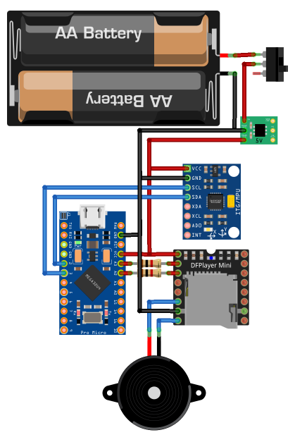

# 戌亥とこ「なにぃ？」

## 概要

にじさんじライバーの戌亥とこさんが喋る「なにぃ」を再生するガジェット

掌の上でコロコロ転がすと「なにぃ」と喋ります。

## 元ネタ

| | 動画 | 投稿日 |
|-|-|-|
| 本編 | [【雑談】動画があがったり、観光局さんとコラボをしたり、いろんな事がありました…【戌亥とこ/にじさんじ】](https://www.youtube.com/watch?v=u8dpY2zJ7hs) | 2021/10/22 |
| 切り抜き　| [マネージャーの手のひらの上で転がされる戌亥【戌亥とこ/にじさんじ切り抜き】](https://www.youtube.com/watch?v=UtjnC_IlBU4) | 2021/10/29 |

## 回路図

## 利用パーツ

* [コントローラ Leonardo Pro Micro Arduino 5V/16MHz](http://www.hiletgo.com/ProductDetail/1971174.html)
  * https://101010.fun/iot/pro-micro-blink-led.html
* [MP3再生モジュール DFPlayer Mini](https://wiki.dfrobot.com/DFPlayer_Mini_SKU_DFR0299)
  * https://akizukidenshi.com/catalog/g/gM-12544/
  * https://blog.hrendoh.com/how-to-use-dfplayer-mini/
  * https://ogimotokin.hatenablog.com/entry/2019/01/24/015536
* [傾きセンサ MPU-6050](https://www.amazon.co.jp/ps61003-MPU-6050-%E4%BD%BF%E7%94%A8-%EF%BC%93%E8%BB%B8%E3%82%B8%E3%83%A3%E3%82%A4%E3%83%AD%E3%82%B9%E3%82%B3%E3%83%BC%E3%83%97%E3%83%BB%EF%BC%93%E8%BB%B8%E5%8A%A0%E9%80%9F%E5%BA%A6%E3%82%BB%E3%83%B3%E3%82%B5%E3%83%BC-%E3%83%A2%E3%82%B8%E3%83%A5%E3%83%BC%E3%83%AB/dp/B008BOPN40)
* [昇圧コンバータ](https://www.amazon.co.jp/gp/product/B08WRPM1ZD/ref=ppx_yo_dt_b_asin_title_o01_s00?ie=UTF8&psc=1)
* 単三電池ホルダー
* 単三電池 x 2
* 1k抵抗 x 2
* スピーカー
* カプセルトイのカプセル

## 開発環境

* vscode + PlatoformIO

## メモ

* `main.cpp` の `setup()` の先頭にある「モニタ接続待ち」コメントアウトを有効にすると、単体で動作しなくなる
* DFPlayer の RX,TX と Leonardo Pro Micro の RX,TX の繋ぎ方をテレコにしてなくてハマった
